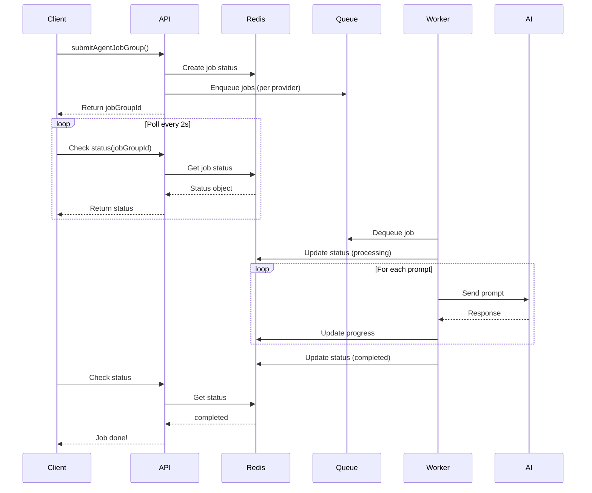

The Agent service manages asynchronous job execution for running user prompts across multiple AI providers. It uses Redis and BullMQ for job queuing, supports parallel execution per provider, and provides real-time status tracking.

## Core Functions

### Job Management

#### submitAgentJobGroup

Creates a job group that executes all workspace prompts across all enabled AI providers.

```typescript
import { submitAgentJobGroup } from "@oneglanse/services";

const result = await submitAgentJobGroup({
  workspaceId: "workspace_abc123",
  userId: "user_xyz789"
});

if (result.status === "queued") {
  console.log(`Job group ID: ${result.jobGroupId}`);
  // Poll for status using this ID
} else if (result.status === "empty") {
  console.log("No prompts configured for this workspace");
}
```

<ParamField path="args" type="object" required>
  <Expandable title="properties">
    <ParamField path="workspaceId" type="string" required>
      Workspace to run prompts for
    </ParamField>
    <ParamField path="userId" type="string" required>
      User triggering the job (for audit trail)
    </ParamField>
  </Expandable>
</ParamField>

<ResponseField name="result" type="SubmitAgentJobResult">
  Union type:
  - `{ status: "queued", jobGroupId: string }` - Jobs successfully queued
  - `{ status: "empty" }` - No prompts found in workspace
</ResponseField>

**Behavior:**
1. Fetches all user prompts via `fetchUserPromptsForWorkspace()`
2. Returns `{ status: "empty" }` if no prompts exist
3. Retrieves workspace to get `enabledProviders` list
4. Generates unique `jobGroupId` (UUID)
5. Creates initial progress object in Redis:
   ```typescript
   {
     status: "pending",
     updateId: 0,
     providers: { perplexity: "pending", chatgpt: "pending", ... },
     results: { perplexity: 0, chatgpt: 0, ... },
     stats: {
       totalPrompts: 5,
       expectedResponses: 15,  // 5 prompts × 3 providers
       actualResponses: 0
     }
   }
   ```
6. Sets Redis key `job:{jobGroupId}:result` with 1-hour TTL
7. Submits one BullMQ job per enabled provider in parallel
8. Returns `jobGroupId` for status polling

**Job Data Structure:**
```typescript
{
  jobGroupId: string;
  provider: Provider;
  prompts: string[];
  user_id: string;
  workspace_id: string;
}
```

**Provider Queues:**
- Each provider has dedicated queue: `oneglanse-agent-{provider}`
- Allows parallel execution across providers
- Isolated failure domains (one provider failure doesn't block others)

---

### Queue Infrastructure

#### getProviderQueue

Retrieves or creates a BullMQ queue for a specific AI provider.

```typescript
import { getProviderQueue } from "@oneglanse/services";
import type { Provider } from "@oneglanse/types";

const queue = getProviderQueue("perplexity");

// Add job
await queue.add("run-agent", {
  jobGroupId: "job_123",
  provider: "perplexity",
  prompts: ["What are the best CRM tools?"],
  user_id: "user_xyz",
  workspace_id: "workspace_abc"
});

// Get queue stats
const counts = await queue.getJobCounts();
console.log(`Active: ${counts.active}, Waiting: ${counts.waiting}`);
```

<ParamField path="provider" type="Provider" required>
  Provider identifier ("perplexity" | "chatgpt" | "gemini" | etc.)
</ParamField>

<ResponseField name="queue" type="Queue">
  BullMQ Queue instance configured with:
  - Queue name: `oneglanse-agent-{provider}`
  - Redis connection from environment variables
  - Default job options:
    - `attempts: 1` (no retries)
    - `removeOnComplete: true` (auto-cleanup)
    - `removeOnFail: false` (preserve for debugging)
</ResponseField>

**Caching:**
- Queues are cached in-memory per provider
- Reuses existing queue instance on subsequent calls
- Reduces Redis connection overhead

**Queue Naming:**
```typescript
getQueueName("perplexity") // => "oneglanse-agent-perplexity"
getQueueName("chatgpt")    // => "oneglanse-agent-chatgpt"
getQueueName("gemini")     // => "oneglanse-agent-gemini"
```

---

### Redis Connection

#### redis

Shared Redis client instance used for job status and rate limiting.

```typescript
import { redis } from "@oneglanse/services";

// Store job result
await redis.set(
  `job:${jobId}:result`,
  JSON.stringify({ status: "completed", data: {...} }),
  "EX",
  3600  // 1 hour TTL
);

// Retrieve job result
const result = await redis.get(`job:${jobId}:result`);
if (result) {
  const parsed = JSON.parse(result);
  console.log(parsed.status);
}

// Check connection
try {
  await redis.ping();
  console.log("Redis connected");
} catch (err) {
  console.error("Redis connection failed");
}
```

**Configuration:**
```typescript
host: env.REDIS_HOST,
password: env.REDIS_PASSWORD,
port: env.REDIS_PORT,
connectTimeout: 10_000,
commandTimeout: 10_000,
maxRetriesPerRequest: 2,
enableOfflineQueue: false,
retryStrategy: (times) => {
  if (times > 10) return null;
  return Math.min(times * 200, 2_000);
}
```

**Features:**
- Lazy connection (doesn't connect until first command)
- Automatic reconnection with exponential backoff
- Command timeout protection
- Offline queue disabled (fail fast)

---

#### waitForRedis

Blocks until Redis connection is established (for server startup).

```typescript
import { waitForRedis } from "@oneglanse/services";

// In server initialization
try {
  await waitForRedis();
  console.log("✓ Redis ready");
  // Start job workers
} catch (err) {
  console.error("✗ Redis unavailable - exiting");
  process.exit(1);
}
```

**Behavior:**
- Pings Redis every 1 second
- Maximum 10 attempts (10 seconds total)
- Logs progress: "⏳ Waiting for Redis..."
- Throws `DatabaseError` if connection fails

---

## Job Status Tracking

The agent service uses Redis to track job progress in real-time:

### Status Object Schema

```typescript
interface JobStatus {
  status: "pending" | "completed";
  updateId: number;              // Increments on each update
  providers: Record<Provider, "pending" | "completed" | "failed">;
  results: Record<Provider, number>;  // Response count per provider
  stats: {
    totalPrompts: number;
    expectedResponses: number;    // totalPrompts × enabled providers
    actualResponses: number;
  };
  error?: string;                // Present if job failed
}
```

### Status Polling Pattern

```typescript
import { redis } from "@oneglanse/services";

async function pollJobStatus(jobGroupId: string): Promise<JobStatus> {
  const key = `job:${jobGroupId}:result`;
  const value = await redis.get(key);
  
  if (!value) {
    return { status: "pending", response: null };
  }
  
  const parsed = JSON.parse(value);
  return {
    status: parsed.status === "completed" ? "completed" : "pending",
    response: parsed
  };
}

// Poll every 2 seconds
const intervalId = setInterval(async () => {
  const status = await pollJobStatus(jobGroupId);
  
  console.log(`Status: ${status.status}`);
  console.log(`Progress: ${status.response?.stats?.actualResponses ?? 0} / ${status.response?.stats?.expectedResponses ?? 0}`);
  
  if (status.status === "completed") {
    clearInterval(intervalId);
    console.log("Job completed!");
  }
}, 2000);
```

### Status Updates (Worker Responsibility)

The worker process (not covered in this service layer) is responsible for:

1. **On Job Start:**
   ```typescript
   status.providers[provider] = "processing";
   await redis.set(`job:${jobGroupId}:result`, JSON.stringify(status));
   ```

2. **On Each Response:**
   ```typescript
   status.results[provider]++;
   status.stats.actualResponses++;
   status.updateId++;
   await redis.set(`job:${jobGroupId}:result`, JSON.stringify(status));
   ```

3. **On Completion:**
   ```typescript
   status.providers[provider] = "completed";
   if (allProvidersComplete) {
     status.status = "completed";
   }
   await redis.set(`job:${jobGroupId}:result`, JSON.stringify(status));
   ```

4. **On Failure:**
   ```typescript
   status.providers[provider] = "failed";
   status.error = errorMessage;
   await redis.set(`job:${jobGroupId}:result`, JSON.stringify(status));
   ```

---

## Usage in tRPC Routers

Example from `apps/web/src/server/api/routers/agent/agent.ts`:

```typescript
import { redis, submitAgentJobGroup } from "@oneglanse/services";
import { authorizedWorkspaceProcedure } from "../../procedures";
import { z } from "zod";

export const agentRouter = createTRPCRouter({
  run: authorizedWorkspaceProcedure
    .mutation(async ({ ctx }) => {
      const { user: { id: userId }, workspaceId } = ctx;
      return submitAgentJobGroup({ workspaceId, userId });
    }),

  status: authorizedWorkspaceProcedure
    .input(z.object({ jobId: z.string() }))
    .query(async ({ input }) => {
      const result = await redis.get(`job:${input.jobId}:result`);
      
      if (!result) {
        return { status: "pending" as const, response: null };
      }
      
      const parsed = JSON.parse(result);
      return {
        status: parsed?.status === "completed" ? "completed" : "pending",
        response: parsed,
      };
    }),
});
```

**Frontend Usage:**
```typescript
// Trigger job
const { jobGroupId } = await trpc.agent.run.mutate();

// Poll for status
const { data } = useQuery({
  queryKey: ['agent', 'status', jobGroupId],
  queryFn: () => trpc.agent.status.query({ jobId: jobGroupId }),
  refetchInterval: 2000,  // Poll every 2 seconds
  enabled: !!jobGroupId
});

if (data?.status === "completed") {
  console.log("Job finished!");
}
```

---

## Environment Variables

Required configuration:

```bash
# Redis connection
REDIS_HOST=localhost
REDIS_PORT=6379
REDIS_PASSWORD=your-redis-password

# Optional: Redis connection string format
REDIS_URL=redis://:password@host:port/db
```

---

## Job Flow Architecture



---

## Error Handling

### submitAgentJobGroup
- Returns `{ status: "empty" }` if no prompts found (not an error)
- Throws if Redis connection fails
- Throws if workspace not found
- Logs warning if no prompts: `[agent] submitAgentJobGroup: no prompts found for workspace ...`

### Redis Connection
- `redis.on('error')` logs errors to console
- `waitForRedis()` throws `DatabaseError` after 10 failed attempts
- Operations fail fast when `enableOfflineQueue: false`

### Queue Operations
- Jobs are not retried (`attempts: 1`)
- Failed jobs remain in queue for inspection (`removeOnFail: false`)
- Completed jobs are auto-removed (`removeOnComplete: true`)

---

## Performance Considerations

### Parallelization
- **Per-Provider Parallelism**: Each provider has dedicated queue and worker pool
- **No Cross-Provider Blocking**: Perplexity slowness doesn't affect ChatGPT
- **Typical Throughput**: 3-5 prompts/second per provider (depends on AI latency)

### Redis TTL
- Job results expire after 1 hour (`EX 3600`)
- Prevents Redis memory growth from abandoned jobs
- Client should handle expired jobs gracefully

### BullMQ Configuration
- Default concurrency: Controlled by worker process (not service layer)
- Recommended: 5-10 concurrent workers per provider queue
- Memory overhead: ~1KB per queued job

---

## Type Definitions

```typescript
import type { Provider } from "@oneglanse/types";
import type { Queue } from "bullmq";
import type { Redis } from "ioredis";

type SubmitAgentJobResult =
  | { status: "queued"; jobGroupId: string }
  | { status: "empty" };

interface JobData {
  jobGroupId: string;
  provider: Provider;
  prompts: string[];
  user_id: string;
  workspace_id: string;
}
```

---

## Source Files

- `packages/services/src/agent/jobs.ts` - Job submission logic
- `packages/services/src/agent/queue.ts` - BullMQ queue management
- `packages/services/src/agent/redis.ts` - Redis client and utilities

All exports are re-exported through `packages/services/src/agent/index.ts`.

---

## Related Services

The Agent service integrates with:
- **Prompt Service**: Fetches prompts via `fetchUserPromptsForWorkspace()`
- **Workspace Service**: Retrieves enabled providers via `getWorkspaceById()`
- **Analysis Service**: Results are stored and analyzed after job completion

For the worker implementation that processes these jobs, see the workers package (not covered in this service layer documentation).