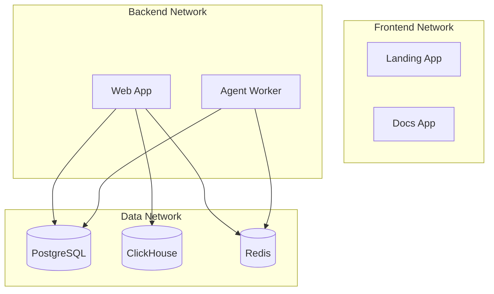

OneGlance uses Docker Compose to orchestrate multiple services including databases, cache, queue workers, and web applications. This guide explains the complete Docker Compose setup.

## Architecture Overview

The Docker Compose configuration defines 9 services across 3 networks:

<CardGroup cols={3}>
  <Card title="Data Services" icon="database">
    PostgreSQL, ClickHouse, Redis
  </Card>
  <Card title="Applications" icon="window">
    Web, Landing, Docs
  </Card>
  <Card title="Workers" icon="gear">
    Agent Worker, Migrations
  </Card>
</CardGroup>

### Network Architecture



## Services

### PostgreSQL (db)

Main application database for storing users, workspaces, prompts, and configuration.

<ParamField path="Image" type="string">
  `ghcr.io/${GHCR_USERNAME}/oneglanse-postgres:latest`
  
  Custom PostgreSQL image with initialization scripts.
</ParamField>

<ParamField path="Container Name" type="string">
  `postgres_db`
</ParamField>

<ParamField path="Volumes" type="array">
  - `db_data:/var/lib/postgresql/data` - Persistent database storage
  - `./packages/db/init-scripts:/docker-entrypoint-initdb.d` - Initialization SQL scripts
</ParamField>

<ParamField path="Networks" type="array">
  - `data` - Internal data network
</ParamField>

<ParamField path="Health Check" type="object">
  ```yaml
  test: ["CMD-SHELL", "pg_isready -U ${POSTGRES_USER} -d ${POSTGRES_DB}"]
  interval: 5s
  timeout: 5s
  retries: 5
  ```
  
  Checks database readiness before dependent services start.
</ParamField>

<ParamField path="Resource Limits" type="object">
  ```yaml
  limits:
    cpus: '1'
    memory: 1G
  reservations:
    cpus: '0.25'
    memory: 256M
  ```
</ParamField>

**Required Environment Variables:**
- `POSTGRES_USER`
- `POSTGRES_PASSWORD`
- `POSTGRES_DB`

**Connection String:**
```bash
DATABASE_URL=postgresql://user:password@db:5432/mydb
```

### ClickHouse (clickhouse)

Analytics database for storing prompt responses, metrics, and time-series data.

<ParamField path="Image" type="string">
  `clickhouse/clickhouse-server:latest`
  
  Official ClickHouse server image.
</ParamField>

<ParamField path="Container Name" type="string">
  `clickhouse_db`
</ParamField>

<ParamField path="Ports" type="array">
  No external ports exposed (internal access only via HTTP on port 8123).
</ParamField>

<ParamField path="Volumes" type="array">
  - `clickhouse_data:/var/lib/clickhouse` - Persistent analytics data
  - `./packages/db/clickhouse-init:/docker-entrypoint-initdb.d` - Initialization scripts
</ParamField>

<ParamField path="Networks" type="array">
  - `data` - Internal data network
</ParamField>

<ParamField path="Health Check" type="object">
  ```yaml
  test: ["CMD-SHELL", "clickhouse-client --user ${CLICKHOUSE_USER} --password ${CLICKHOUSE_PASSWORD} --query 'SELECT 1'"]
  interval: 10s
  timeout: 5s
  retries: 5
  start_period: 60s
  ```
  
  Longer start period (60s) allows ClickHouse initialization to complete.
</ParamField>

<ParamField path="Resource Limits" type="object">
  ```yaml
  limits:
    cpus: '2'
    memory: 2G
  reservations:
    cpus: '0.5'
    memory: 512M
  ```
</ParamField>

**Required Environment Variables:**
- `CLICKHOUSE_USER`
- `CLICKHOUSE_PASSWORD`
- `CLICKHOUSE_DB`

**Connection URL:**
```bash
CLICKHOUSE_URL=http://clickhouse:8123
```

### Redis (redis)

In-memory data store for BullMQ job queues and application caching.

<ParamField path="Image" type="string">
  `redis:7-alpine`
  
  Lightweight Redis 7 image.
</ParamField>

<ParamField path="Container Name" type="string">
  `redis`
</ParamField>

<ParamField path="Command" type="string">
  ```bash
  redis-server --requirepass ${REDIS_PASSWORD}
  ```
  
  Starts Redis with password authentication enabled.
</ParamField>

<ParamField path="Volumes" type="array">
  - `redis_data:/data` - Persistent cache and queue data
</ParamField>

<ParamField path="Networks" type="array">
  - `data` - Internal data network
</ParamField>

<ParamField path="Health Check" type="object">
  ```yaml
  test: ["CMD-SHELL", "redis-cli -a \"${REDIS_PASSWORD}\" --no-auth-warning ping"]
  interval: 5s
  timeout: 3s
  retries: 5
  ```
</ParamField>

<ParamField path="Resource Limits" type="object">
  ```yaml
  limits:
    cpus: '0.5'
    memory: 512M
  reservations:
    cpus: '0.1'
    memory: 128M
  ```
</ParamField>

**Required Environment Variables:**
- `REDIS_PASSWORD`

**Connection URL:**
```bash
REDIS_URL=redis://:password@redis:6379
```

<Warning>
  Redis requires password authentication. Ensure `REDIS_PASSWORD` is set in `.env` and matches in `apps/agent/.env`.
</Warning>

### Web App (web)

Main authenticated product application (Next.js 15 + tRPC).

<ParamField path="Image" type="string">
  `ghcr.io/${GHCR_USERNAME}/oneglanse-web:latest`
</ParamField>

<ParamField path="Container Name" type="string">
  `oneglanse-web`
</ParamField>

<ParamField path="Ports" type="array">
  - `127.0.0.1:3001:3000` - Web interface bound to localhost only
</ParamField>

<ParamField path="Networks" type="array">
  - `frontend` - Public-facing network
  - `backend` - Internal backend communication
  - `data` - Database access
</ParamField>

<ParamField path="Environment" type="object">
  ```yaml
  HOSTNAME: 0.0.0.0
  PORT: "3000"
  ```
  
  Plus all variables from `.env`.
</ParamField>

<ParamField path="Dependencies" type="array">
  Waits for:
  - `db` (healthy)
  - `migrate` (completed successfully)
  - `redis` (healthy)
  - `clickhouse` (healthy)
</ParamField>

<ParamField path="Resource Limits" type="object">
  ```yaml
  limits:
    cpus: '1'
    memory: 1G
  reservations:
    cpus: '0.25'
    memory: 256M
  ```
</ParamField>

**Access:** http://localhost:3001

### Landing App (landing)

Public marketing website.

<ParamField path="Image" type="string">
  `ghcr.io/${GHCR_USERNAME}/oneglanse-landing:latest`
</ParamField>

<ParamField path="Container Name" type="string">
  `oneglanse-landing`
</ParamField>

<ParamField path="Ports" type="array">
  - `127.0.0.1:3000:3000` - Public website bound to localhost
</ParamField>

<ParamField path="Networks" type="array">
  - `frontend` - Public-facing network only
</ParamField>

<ParamField path="Environment" type="object">
  ```yaml
  HOSTNAME: 0.0.0.0
  PORT: "3000"
  ```
</ParamField>

<ParamField path="Resource Limits" type="object">
  ```yaml
  limits:
    cpus: '0.5'
    memory: 512M
  reservations:
    cpus: '0.1'
    memory: 128M
  ```
</ParamField>

**Access:** http://localhost:3000

### Docs App (docs)

Public technical documentation site.

<ParamField path="Image" type="string">
  `ghcr.io/${GHCR_USERNAME}/oneglanse-docs:latest`
</ParamField>

<ParamField path="Container Name" type="string">
  `oneglanse-docs`
</ParamField>

<ParamField path="Ports" type="array">
  - `127.0.0.1:3002:3002` - Documentation site bound to localhost
</ParamField>

<ParamField path="Networks" type="array">
  - `frontend` - Public-facing network only
</ParamField>

<ParamField path="Environment" type="object">
  ```yaml
  HOSTNAME: 0.0.0.0
  PORT: "3002"
  ```
</ParamField>

<ParamField path="Resource Limits" type="object">
  ```yaml
  limits:
    cpus: '0.5'
    memory: 512M
  reservations:
    cpus: '0.1'
    memory: 128M
  ```
</ParamField>

**Access:** http://localhost:3002

### Agent Worker (agent-worker)

BullMQ worker that processes browser automation jobs using Playwright.

<ParamField path="Image" type="string">
  `ghcr.io/${GHCR_USERNAME}/oneglanse-agent:latest`
</ParamField>

<ParamField path="Container Name" type="string">
  `oneglanse-agent-worker`
</ParamField>

<ParamField path="Command" type="string">
  ```bash
  pnpm start:worker
  ```
</ParamField>

<ParamField path="Shared Memory" type="string">
  `1gb`
  
  Required for Chromium browser instances.
</ParamField>

<ParamField path="Stop Grace Period" type="string">
  `16m`
  
  Allows long-running browser jobs to complete gracefully before shutdown.
</ParamField>

<ParamField path="Volumes" type="array">
  - `agent_storage:/storage` - Browser profiles and session data
</ParamField>

<ParamField path="Networks" type="array">
  - `backend` - Communication with web app
  - `data` - Redis queue access
</ParamField>

<ParamField path="Environment Files" type="array">
  - `.env` - Shared environment variables
  - `apps/agent/.env` - Agent-specific configuration
</ParamField>

<ParamField path="Dependencies" type="array">
  Waits for:
  - `redis` (healthy)
</ParamField>

<ParamField path="Health Check" type="object">
  ```yaml
  test: ["CMD", "node", "-e", "require('ioredis').default({host:'redis'}).ping().then(()=>process.exit(0)).catch(()=>process.exit(1))"]
  interval: 15s
  timeout: 10s
  retries: 3
  start_period: 20s
  ```
  
  Verifies Redis connectivity.
</ParamField>

<ParamField path="Resource Limits" type="object">
  ```yaml
  limits:
    cpus: '2'
    memory: 4G
  reservations:
    cpus: '1'
    memory: 1G
  ```
  
  Higher resources for browser automation.
</ParamField>

<Warning>
  The agent worker requires significant resources for browser instances. Adjust `AGENT_WORKER_CONCURRENCY` based on available CPU/memory.
</Warning>

### Database Migrations (migrate)

One-shot service that runs Drizzle ORM migrations on startup.

<ParamField path="Image" type="string">
  `ghcr.io/${GHCR_USERNAME}/oneglanse-web:latest`
  
  Uses web image which contains the `@oneglanse/db` package.
</ParamField>

<ParamField path="Container Name" type="string">
  `oneglanse-migrate`
</ParamField>

<ParamField path="Command" type="string">
  ```bash
  pnpm --filter @oneglanse/db db:migrate
  ```
</ParamField>

<ParamField path="Restart Policy" type="string">
  `no`
  
  Runs once and exits.
</ParamField>

<ParamField path="Networks" type="array">
  - `data` - Database access
</ParamField>

<ParamField path="Dependencies" type="array">
  Waits for:
  - `db` (healthy)
</ParamField>

## Volumes

Persistent storage volumes for stateful services:

<ResponseField name="db_data" type="volume">
  PostgreSQL database files. Contains all application data including users, workspaces, prompts.
  
  **Location**: `/var/lib/postgresql/data` in container
</ResponseField>

<ResponseField name="clickhouse_data" type="volume">
  ClickHouse database files. Contains analytics data, prompt responses, metrics.
  
  **Location**: `/var/lib/clickhouse` in container
</ResponseField>

<ResponseField name="redis_data" type="volume">
  Redis persistence files. Contains job queues and cache data.
  
  **Location**: `/data` in container
</ResponseField>

<ResponseField name="agent_storage" type="volume">
  Agent worker storage. Contains browser profiles, authentication data, temporary files.
  
  **Location**: `/storage` in container
</ResponseField>

<Warning>
  Deleting volumes will permanently destroy data. Use `docker compose down -v` with caution.
</Warning>

## Networks

Three isolated networks for security and organization:

<ResponseField name="frontend" type="bridge">
  **Purpose**: Public-facing applications
  
  **Services**: Landing, Docs, Web
  
  Applications that serve HTTP traffic to users.
</ResponseField>

<ResponseField name="backend" type="bridge">
  **Purpose**: Internal service communication
  
  **Services**: Web, Agent Worker
  
  Services that communicate internally but don't need database access.
</ResponseField>

<ResponseField name="data" type="bridge">
  **Purpose**: Database and cache access
  
  **Services**: DB, ClickHouse, Redis, Web, Agent Worker, Migrate
  
  Services that require direct database or cache connectivity.
</ResponseField>

## Common Commands

### Starting Services

<CodeGroup>
```bash Start All Services
docker compose up -d
```

```bash Start Specific Services
# Start only infrastructure
docker compose up -d db clickhouse redis

# Start only applications
docker compose up -d web landing docs

# Start with logs
docker compose up web
```

```bash Start with Build
# Rebuild images before starting
docker compose up -d --build
```
</CodeGroup>

### Stopping Services

<CodeGroup>
```bash Stop All Services
docker compose down
```

```bash Stop and Remove Volumes
# WARNING: This deletes all data
docker compose down -v
```

```bash Stop Specific Services
docker compose stop web agent-worker
```
</CodeGroup>

### Viewing Logs

<CodeGroup>
```bash All Service Logs
docker compose logs -f
```

```bash Specific Service Logs
docker compose logs -f web
docker compose logs -f agent-worker
docker compose logs -f db
```

```bash Recent Logs
# Last 100 lines
docker compose logs --tail=100 web
```
</CodeGroup>

### Service Management

<CodeGroup>
```bash Check Service Status
docker compose ps
```

```bash Restart Services
# Restart specific service
docker compose restart web

# Restart all
docker compose restart
```

```bash Execute Commands
# PostgreSQL
docker compose exec db psql -U user -d mydb

# ClickHouse
docker compose exec clickhouse clickhouse-client

# Redis
docker compose exec redis redis-cli -a password

# Shell access
docker compose exec web sh
```
</CodeGroup>

### Health Checks

<CodeGroup>
```bash Check All Health Status
docker compose ps
```

```bash Inspect Service Health
docker inspect oneglanse-web --format='{{.State.Health.Status}}'
```

```bash Wait for Healthy
# Wait for database to be healthy
until [ "$(docker inspect postgres_db --format='{{.State.Health.Status}}')" = "healthy" ]; do
  echo "Waiting for database..."
  sleep 2
done
```
</CodeGroup>

## Port Mappings

Services accessible from the host machine:

| Service | Container Port | Host Port | URL |
|---------|---------------|-----------|-----|
| Web App | 3000 | 3001 | http://localhost:3001 |
| Landing | 3000 | 3000 | http://localhost:3000 |
| Docs | 3002 | 3002 | http://localhost:3002 |
| PostgreSQL | 5432 | Not exposed | Internal only |
| ClickHouse | 8123 | Not exposed | Internal only |
| Redis | 6379 | Not exposed | Internal only |

<Note>
  Database services are not exposed to the host for security. Use `docker compose exec` to access them directly.
</Note>

## Resource Management

Total resource allocation when all services are running:

<ResponseField name="CPU" type="limits">
  **Maximum**: 7.5 CPUs
  **Reserved**: 2.85 CPUs
</ResponseField>

<ResponseField name="Memory" type="limits">
  **Maximum**: 9.5 GB
  **Reserved**: 2.6 GB
</ResponseField>

### Adjusting Resources

Modify resource limits in `docker-compose.yml`:

```yaml
agent-worker:
  deploy:
    resources:
      limits:
        cpus: '4'  # Increase for more concurrent jobs
        memory: 8G
      reservations:
        cpus: '2'
        memory: 2G
```

## Troubleshooting

<AccordionGroup>
  <Accordion title="Services won't start">
    **Problem**: Services fail to start or remain unhealthy.

    **Solutions**:
    
    1. Check service logs:
       ```bash
       docker compose logs <service-name>
       ```
    
    2. Verify environment variables:
       ```bash
       docker compose config
       ```
    
    3. Ensure `GHCR_USERNAME` is set:
       ```bash
       echo $GHCR_USERNAME
       ```
    
    4. Check Docker resources in Docker Desktop settings
    
    5. Reset everything:
       ```bash
       docker compose down -v
       docker compose up -d
       ```
  </Accordion>

  <Accordion title="Port already in use">
    **Problem**: Port binding errors on startup.

    **Solutions**:
    
    1. Find process using the port:
       ```bash
       lsof -i :3000
       lsof -i :3001
       lsof -i :3002
       ```
    
    2. Stop conflicting service or change port in `docker-compose.yml`:
       ```yaml
       ports:
         - "127.0.0.1:3003:3000"  # Use port 3003 instead
       ```
  </Accordion>

  <Accordion title="Database connection errors">
    **Problem**: Applications can't connect to databases.

    **Solutions**:
    
    1. Verify database is healthy:
       ```bash
       docker compose ps db
       ```
    
    2. Check DATABASE_URL uses service name:
       ```bash
       DATABASE_URL=postgresql://user:password@db:5432/mydb
       ```
    
    3. Test connection:
       ```bash
       docker compose exec web sh -c 'ping -c 1 db'
       ```
    
    4. Verify credentials match:
       ```bash
       docker compose exec db psql -U $POSTGRES_USER -d $POSTGRES_DB
       ```
  </Accordion>

  <Accordion title="Migration fails">
    **Problem**: `migrate` service fails or exits with error.

    **Solutions**:
    
    1. Check migration logs:
       ```bash
       docker compose logs migrate
       ```
    
    2. Ensure database is ready:
       ```bash
       docker compose ps db
       ```
    
    3. Run manually:
       ```bash
       docker compose run --rm migrate
       ```
    
    4. Reset database (development only):
       ```bash
       docker compose down -v
       docker compose up -d db
       docker compose run --rm migrate
       ```
  </Accordion>

  <Accordion title="Agent worker not processing jobs">
    **Problem**: Jobs queue but aren't executed.

    **Solutions**:
    
    1. Check agent worker logs:
       ```bash
       docker compose logs -f agent-worker
       ```
    
    2. Verify Redis connectivity:
       ```bash
       docker compose exec agent-worker sh -c 'ping -c 1 redis'
       ```
    
    3. Check Redis password matches in `.env` and `apps/agent/.env`
    
    4. Restart worker:
       ```bash
       docker compose restart agent-worker
       ```
    
    5. Increase worker concurrency in `.env`:
       ```bash
       AGENT_WORKER_CONCURRENCY=2
       ```
  </Accordion>

  <Accordion title="Out of memory errors">
    **Problem**: Services crash with OOM errors.

    **Solutions**:
    
    1. Increase Docker memory limit in Docker Desktop
    
    2. Reduce agent worker concurrency:
       ```bash
       AGENT_WORKER_CONCURRENCY=1
       ```
    
    3. Adjust memory limits in `docker-compose.yml`
    
    4. Monitor resource usage:
       ```bash
       docker stats
       ```
  </Accordion>

  <Accordion title="Image pull failures">
    **Problem**: Can't pull Docker images from GHCR.

    **Solutions**:
    
    1. Verify `GHCR_USERNAME` is set:
       ```bash
       echo $GHCR_USERNAME
       ```
    
    2. Authenticate with GHCR:
       ```bash
       echo $GITHUB_TOKEN | docker login ghcr.io -u $GHCR_USERNAME --password-stdin
       ```
    
    3. Check image exists:
       ```bash
       docker pull ghcr.io/$GHCR_USERNAME/oneglanse-web:latest
       ```
    
    4. For private repos, ensure GitHub token has `read:packages` scope
  </Accordion>
</AccordionGroup>

## Production Considerations

<Warning>
  Additional configuration required for production deployments:
</Warning>

1. **Use External Databases**
   - Managed PostgreSQL (RDS, Cloud SQL)
   - Managed Redis (ElastiCache, Redis Cloud)
   - Managed ClickHouse (ClickHouse Cloud)

2. **Configure Reverse Proxy**
   - Use nginx or Traefik in front of services
   - Configure SSL/TLS certificates
   - Set up domain routing

3. **Enable Monitoring**
   - Add Prometheus for metrics
   - Configure logging aggregation
   - Set up health check endpoints

4. **Secrets Management**
   - Use Docker secrets or external secret managers
   - Never commit `.env` with production credentials
   - Rotate secrets regularly

5. **Backup Strategy**
   - Automate volume backups
   - Test restore procedures
   - Document backup retention policy

6. **Security Hardening**
   - Run containers as non-root users
   - Enable Docker Content Trust
   - Scan images for vulnerabilities
   - Use private networks

## Next Steps

<CardGroup cols={2}>
  <Card title="Local Setup" icon="laptop-code" href="/development/local-setup">
    Complete local development setup guide
  </Card>
  <Card title="Environment Variables" icon="key" href="/development/environment-variables">
    Learn about all environment variables
  </Card>
  <Card title="Architecture" icon="sitemap" href="/architecture/overview">
    Understand the system architecture
  </Card>
  <Card title="Deployment" icon="rocket" href="/deployment/production">
    Deploy to production
  </Card>
</CardGroup>