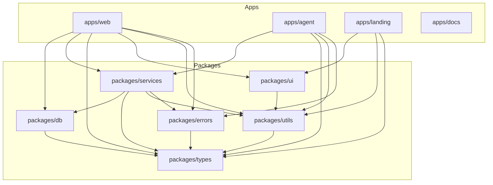

# Monorepo Structure

OneGlance uses a **pnpm + Turborepo** monorepo structure with clear separation between applications and shared packages.

## Repository Overview

The monorepo is organized into two top-level directories:

- **`apps/`**: Deployable applications
- **`packages/`**: Shared libraries and utilities

```
~/workspace/source/
├── apps/
│   ├── web/              # Main authenticated product app
│   ├── agent/            # BullMQ + Playwright worker
│   ├── landing/          # Public marketing site
│   └── docs/             # Public documentation (Nextra)
├── packages/
│   ├── db/               # Database clients and schemas
│   ├── services/         # Business logic layer
│   ├── types/            # Shared TypeScript types
│   ├── ui/               # React component library
│   ├── utils/            # Utility functions
│   └── errors/           # Error classes and handlers
├── turbo.json            # Turborepo pipeline configuration
├── package.json          # Root workspace configuration
├── pnpm-workspace.yaml   # pnpm workspace definition
└── README.md             # Repository documentation
```

## Applications (`apps/`)

### `apps/web` - Main Product Application

**Purpose**: Primary authenticated SaaS application for brand tracking

**Tech Stack**:
- Next.js 15 (App Router)
- tRPC for API routes
- Better Auth for authentication
- React Query for data fetching
- Tailwind CSS + `@oneglanse/ui` components

**Directory Structure**:
```
apps/web/src/
├── app/
│   ├── (auth)/              # Authenticated routes
│   │   ├── dashboard/       # Main analytics dashboard
│   │   ├── prompts/         # Prompt management
│   │   ├── sources/         # Source tracking
│   │   ├── schedule/        # Scheduling configuration
│   │   ├── settings/        # User settings
│   │   ├── workspace/       # Workspace settings
│   │   └── layout.tsx       # Authenticated layout
│   ├── api/
│   │   ├── auth/            # Better Auth endpoints
│   │   └── trpc/            # tRPC handler
│   ├── login/               # Login page
│   └── layout.tsx           # Root layout
├── components/              # React components
│   ├── dashboard/
│   ├── prompts/
│   └── shared/
├── lib/
│   ├── auth/                # Auth configuration
│   └── utils/               # App-specific utilities
├── server/
│   └── api/
│       ├── routers/         # tRPC routers
│       │   ├── agent/       # Agent job management
│       │   ├── analysis/    # Analysis queries
│       │   ├── prompt/      # Prompt CRUD
│       │   ├── workspace/   # Workspace management
│       │   └── internal/    # Internal/cron endpoints
│       ├── middleware/      # tRPC middleware
│       ├── procedures.ts    # Reusable procedures
│       ├── root.ts          # Root router
│       └── trpc.ts          # tRPC initialization
├── trpc/
│   ├── client.tsx           # Client tRPC setup
│   └── server.ts            # Server caller factory
└── env.js                   # Environment validation
```

**Key Files**:
- `src/server/api/root.ts` - Main tRPC router composition
- `src/server/api/trpc.ts` - tRPC context and initialization
- `src/app/(auth)/dashboard/page.tsx` - Main dashboard entry
- `src/lib/auth/auth.ts` - Better Auth configuration

**Package Name**: `@oneglanse/web`

**Scripts**:
```bash
pnpm dev:web      # Start dev server (http://localhost:3000)
pnpm build        # Production build
pnpm start        # Start production server
```

**Dependencies**:
- `@oneglanse/db` - Database access
- `@oneglanse/services` - Business logic
- `@oneglanse/types` - Shared types
- `@oneglanse/ui` - UI components
- `@oneglanse/utils` - Utilities
- `@oneglanse/errors` - Error handling

### `apps/agent` - Worker Service

**Purpose**: Headless worker that executes browser automation jobs

**Tech Stack**:
- Node.js + TypeScript
- BullMQ for job processing
- Playwright for browser automation
- Redis for queue storage

**Directory Structure**:
```
apps/agent/src/
├── core/
│   ├── providers/           # Provider-specific automation
│   │   ├── chatgpt/         # ChatGPT automation
│   │   ├── claude/          # Claude automation
│   │   ├── gemini/          # Gemini automation
│   │   ├── perplexity/      # Perplexity automation
│   │   ├── ai-overview/     # Google AI Overview
│   │   ├── _shared/         # Shared provider utilities
│   │   ├── types.ts         # Provider types
│   │   └── index.ts         # Provider registry
│   ├── prompt-runner/       # Prompt execution logic
│   │   ├── executePrompt.ts
│   │   ├── retryPolicy.ts
│   │   └── index.ts
│   ├── agentHandler.ts      # Main job handler
│   ├── createAgent.ts       # Browser factory
│   └── runAgents.ts         # Multi-prompt runner
├── lib/
│   ├── browser/             # Browser management
│   │   ├── proxy/           # Proxy rotation
│   │   ├── warmPool.ts      # Warm browser pool
│   │   └── navigate.ts      # Navigation helpers
│   └── providerContext.ts   # Provider-scoped context
├── worker/
│   ├── jobHandler.ts        # BullMQ job handler
│   └── analysis.ts          # Analysis job trigger
├── index.ts                 # Main entry point
├── worker.ts                # Worker initialization
└── env.ts                   # Environment validation
```

**Key Files**:
- `src/worker.ts:12-55` - Worker initialization with per-provider queues
- `src/worker/jobHandler.ts:81-188` - Job processing logic
- `src/core/agentHandler.ts:11-62` - Provider automation handler
- `src/core/providers/chatgpt/index.ts` - ChatGPT-specific automation

**Package Name**: `@oneglanse/agent`

**Scripts**:
```bash
pnpm dev:agent        # Start worker in dev mode
pnpm build            # Compile TypeScript
pnpm start:worker     # Start production worker
```

**Dependencies**:
- `@oneglanse/services` - Job submission and storage
- `@oneglanse/types` - Shared types
- `@oneglanse/utils` - Logging and utilities
- `@oneglanse/errors` - Error handling
- `playwright` - Browser automation
- `bullmq` - Job queue processing

### `apps/landing` - Marketing Site

**Purpose**: Public-facing marketing website

**Tech Stack**:
- Next.js 15 (App Router)
- Tailwind CSS
- `@oneglanse/ui` components

**Package Name**: `@oneglanse/landing`

**Scripts**:
```bash
pnpm dev:landing      # Start dev server (http://localhost:3000)
pnpm build            # Production build
```

**Dependencies**:
- `@oneglanse/ui` - Shared UI components
- `@oneglanse/utils` - Utilities

### `apps/docs` - Documentation Site

**Purpose**: Public technical documentation

**Tech Stack**:
- Next.js 15
- Nextra (documentation framework)
- Nextra Docs Theme

**Package Name**: `@oneglanse/docs`

**Scripts**:
```bash
pnpm dev:docs         # Start dev server (http://localhost:3002)
pnpm build            # Production build
```

**Content Location**: `apps/docs/content/`

## Shared Packages (`packages/`)

### `packages/db` - Database Layer

**Purpose**: Centralized database access with schemas and migrations

**Exports**:
- PostgreSQL client (Drizzle ORM)
- ClickHouse client
- Database schemas
- Type definitions

**Directory Structure**:
```
packages/db/src/
├── clients/
│   ├── postgres.ts          # Drizzle client
│   └── clickhouse.ts        # ClickHouse client
├── config/
│   ├── postgres.ts          # PG connection config
│   └── clickhouse.ts        # CH connection config
├── schema/
│   ├── auth.ts              # Better Auth tables
│   ├── workspace.ts         # Workspace, prompts, etc.
│   └── index.ts             # Schema exports
├── drizzle/                 # Migrations (generated)
├── clickhouse-init/         # ClickHouse schemas
├── index.ts                 # Main exports
└── types.ts                 # Database types
```

**Key Exports**:
```typescript
import { db } from "@oneglanse/db";           // PostgreSQL client
import { clickhouse } from "@oneglanse/db";    // ClickHouse client
import { schema } from "@oneglanse/db";        // Drizzle schemas
```

**Package Name**: `@oneglanse/db`

**Scripts**:
```bash
pnpm db:generate      # Generate Drizzle migrations
pnpm db:migrate       # Run migrations
pnpm db:push          # Push schema (dev only)
pnpm db:studio        # Open Drizzle Studio
```

**Dependencies**:
- `drizzle-orm` - ORM
- `@clickhouse/client` - ClickHouse driver
- `pg` - PostgreSQL driver

### `packages/services` - Business Logic Layer

**Purpose**: Reusable business logic shared across apps

**Directory Structure**:
```
packages/services/src/
├── agent/
│   ├── queue.ts             # BullMQ queue manager
│   ├── jobs.ts              # Job submission
│   └── redis.ts             # Redis connection
├── analysis/
│   ├── runAnalysis.ts       # LLM analysis runner
│   ├── analysis.ts          # Analysis storage
│   └── analysisPrompt.ts    # Prompt builder
├── prompt/
│   ├── prompt.ts            # Prompt CRUD
│   └── index.ts
├── workspace/
│   ├── workspace.ts         # Workspace management
│   └── index.ts
├── llm/
│   └── index.ts             # OpenAI client
├── env.ts                   # Environment validation
└── index.ts                 # Main exports
```

**Key Exports**:
```typescript
import { 
  submitAgentJobGroup,      // Submit jobs to queue
  getProviderQueue,         // Get provider queue
  redis,                    // Redis client
  storePromptResponses,     // Store responses
  runAnalysis,              // Run LLM analysis
  fetchUserPromptsForWorkspace, // Get prompts
  getWorkspaceById,         // Get workspace
} from "@oneglanse/services";
```

**Package Name**: `@oneglanse/services`

**Dependencies**:
- `@oneglanse/db` - Database access
- `@oneglanse/types` - Shared types
- `@oneglanse/utils` - Utilities
- `@oneglanse/errors` - Error handling
- `bullmq` - Job queue
- `ioredis` - Redis client
- `openai` - OpenAI API

### `packages/types` - Shared Types

**Purpose**: TypeScript type definitions shared across workspace

**Directory Structure**:
```
packages/types/src/
├── types/
│   ├── agent.ts             # Agent job types
│   ├── analysis.ts          # Analysis types
│   ├── entities.ts          # Domain entities
│   ├── metrics.ts           # Metrics types
│   ├── prompts.ts           # Prompt types
│   ├── sources.ts           # Source types
│   ├── browser.ts           # Browser types
│   └── services.ts          # Service types
└── index.ts                 # Main exports
```

**Key Types**:
```typescript
import type {
  Provider,                  // "chatgpt" | "claude" | ...
  UserPrompt,                // Prompt entity
  PromptPayload,             // Job payload
  AgentResult,               // Agent execution result
  BrandAnalysisResult,       // Analysis result
  AnalysisInputSingle,       // Analysis input
} from "@oneglanse/types";
```

**Package Name**: `@oneglanse/types`

**No Runtime Dependencies** - Pure TypeScript types

### `packages/ui` - Component Library

**Purpose**: Reusable React components with Tailwind styling

**Directory Structure**:
```
packages/ui/src/
├── components/
│   ├── button.tsx
│   ├── card.tsx
│   ├── dialog.tsx
│   ├── input.tsx
│   ├── select.tsx
│   ├── table.tsx
│   └── ...
├── hooks/
│   ├── use-toast.ts
│   └── ...
├── styles/
│   └── shared.css           # Shared Tailwind styles
└── index.ts                 # Main exports
```

**Key Components**:
```typescript
import { 
  Button,
  Card,
  Dialog,
  Input,
  Select,
  Table,
} from "@oneglanse/ui";
```

**Package Name**: `@oneglanse/ui`

**Dependencies**:
- Radix UI primitives
- `class-variance-authority` - Component variants
- `lucide-react` - Icons
- `sonner` - Toast notifications

### `packages/utils` - Utility Functions

**Purpose**: Shared utility functions and helpers

**Directory Structure**:
```
packages/utils/src/
├── agent/                   # Agent utilities
├── analysis/                # Analysis helpers
├── async/                   # Async utilities
├── extract/                 # Data extraction
├── format/                  # Formatting helpers
├── sources/                 # Source utilities
├── url/                     # URL utilities
├── web/                     # Web utilities
├── workspace/               # Workspace helpers
├── cn.ts                    # Tailwind merge
├── favicon.ts               # Favicon utilities
├── id.ts                    # ID generation
├── logger.ts                # Logging utilities
└── index.ts                 # Main exports
```

**Key Exports**:
```typescript
import { 
  logger,                    // Structured logger
  createProviderLogger,      // Provider-specific logger
  cn,                        // Tailwind class merge
  formatDate,                // Date formatting
  extractDomain,             // URL parsing
} from "@oneglanse/utils";
```

**Package Name**: `@oneglanse/utils`

**Dependencies**:
- `clsx` - Class names
- `tailwind-merge` - Tailwind utilities
- `marked` - Markdown parsing
- `sanitize-html` - HTML sanitization

### `packages/errors` - Error Handling

**Purpose**: Domain-specific error classes and error handling utilities

**Directory Structure**:
```
packages/errors/src/
├── errors.ts                # Error class definitions
├── handlers.ts              # Error handlers
└── index.ts                 # Main exports
```

**Key Exports**:
```typescript
import { 
  BaseError,                 // Base error class
  ValidationError,           // Validation errors
  ExternalServiceError,      // External API errors
  toErrorMessage,            // Error message extraction
} from "@oneglanse/errors";
```

**Package Name**: `@oneglanse/errors`

**Dependencies**:
- `@oneglanse/types` - Type definitions

## Dependency Graph



## Workspace Standards

As documented in the root README (`~/workspace/source/README.md:142-148`):

- **App-level business logic** should call `@oneglanse/services`
- **Cross-app contracts** should live in `@oneglanse/types`
- **Reusable presentational UI** should live in `@oneglanse/ui`
- **Generic helpers** should live in `@oneglanse/utils`
- **Shared error primitives** should come from `@oneglanse/errors`

## Package Manager: pnpm

**Why pnpm**:
- Fast, disk-efficient installations
- Strict dependency resolution (no phantom dependencies)
- Native workspace support
- Better monorepo performance than npm/yarn

**Configuration** (`pnpm-workspace.yaml`):
```yaml
packages:
  - "apps/*"
  - "packages/*"
```

**Workspace Protocol**:
All internal dependencies use `workspace:*`:

```json
{
  "dependencies": {
    "@oneglanse/db": "workspace:*",
    "@oneglanse/types": "workspace:*"
  }
}
```

## Build Orchestration: Turborepo

**Pipeline Configuration** (`turbo.json:3-32`):

```json
{
  "tasks": {
    "build": {
      "dependsOn": ["^build"],
      "outputs": ["dist/**", ".next/**", "!.next/cache/**"]
    },
    "dev": {
      "dependsOn": ["^build"],
      "cache": false,
      "persistent": true
    },
    "typecheck": {
      "dependsOn": ["^build"],
      "outputs": []
    }
  }
}
```

**Key Features**:
- **Incremental builds**: Only rebuilds changed packages
- **Dependency-aware**: Builds packages in correct order
- **Caching**: Skips unchanged tasks
- **Parallel execution**: Runs independent tasks concurrently

**Common Commands**:
```bash
pnpm build              # Build all packages/apps
pnpm dev                # Start all dev servers
pnpm dev:web            # Start only web app
pnpm dev:agent          # Start only agent worker
pnpm typecheck          # Type-check all workspaces
pnpm lint               # Lint all workspaces
```

## Root Scripts

From `package.json:4-23`:

```json
{
  "scripts": {
    "build": "turbo build",
    "dev": "turbo dev",
    "dev:web": "turbo dev --filter=@oneglanse/web",
    "dev:agent": "turbo dev --filter=@oneglanse/agent",
    "dev:landing": "turbo dev --filter=@oneglanse/landing",
    "dev:docs": "turbo dev --filter=@oneglanse/docs",
    "lint": "turbo lint",
    "typecheck": "turbo typecheck",
    "clean": "turbo clean && rm -rf node_modules",
    "db:generate": "pnpm --filter @oneglanse/db db:generate",
    "db:migrate": "pnpm --filter @oneglanse/db db:migrate",
    "db:push": "pnpm --filter @oneglanse/db db:push",
    "db:studio": "pnpm --filter @oneglanse/db db:studio"
  }
}
```

## Contributor Navigation

From the root README (`~/workspace/source/README.md:150-160`):

**Start here based on task type**:

| Task | Location |
|------|----------|
| Product/API behavior | `apps/web` + `packages/services` |
| Provider automation / queue behavior | `apps/agent` + `packages/services/src/agent` |
| Data/schema work | `packages/db` |
| Shared contracts | `packages/types` |
| Shared components | `packages/ui` |
| Generic helpers | `packages/utils` |

## File Path Examples

**tRPC Router**: `~/workspace/source/apps/web/src/server/api/routers/agent/agent.ts`

**Job Handler**: `~/workspace/source/apps/agent/src/worker/jobHandler.ts`

**Queue Manager**: `~/workspace/source/packages/services/src/agent/queue.ts`

**Database Schema**: `~/workspace/source/packages/db/src/schema/workspace.ts`

**Provider Automation**: `~/workspace/source/apps/agent/src/core/providers/chatgpt/index.ts`

## Related Documentation

- [System Architecture Overview](/development/overview) - High-level architecture
- [Tech Stack](/development/tech-stack) - Technology choices and versions