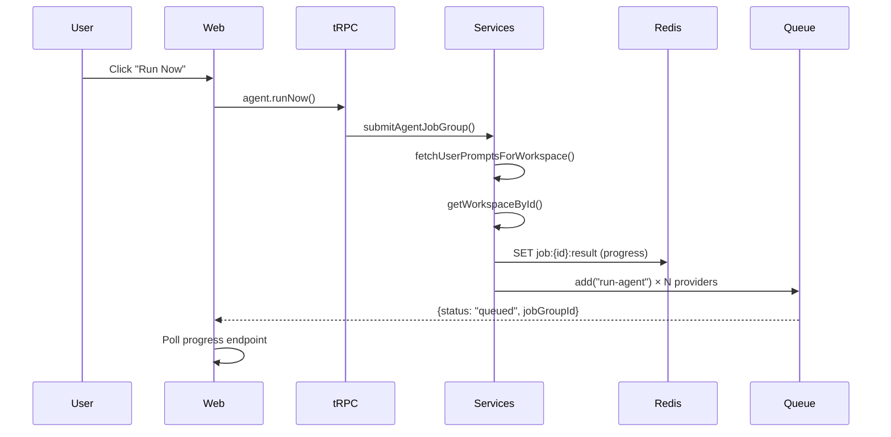
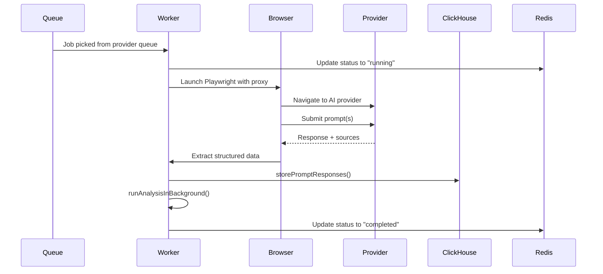
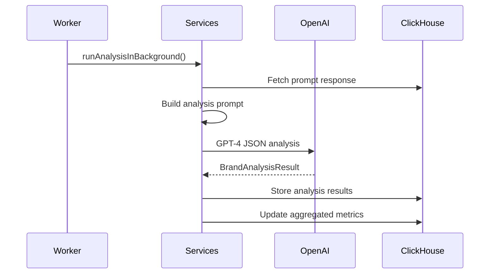

# System Architecture Overview

OneGlance is a distributed system that tracks how AI providers mention brands by running scheduled prompts across multiple LLM platforms, capturing responses, and analyzing visibility, sentiment, and position metrics.

## High-Level Architecture

```mermaid
graph TB
    subgraph "User Interface"
        Web[Web App - Next.js]
        Landing[Landing Site]
    end
    
    subgraph "API Layer"
        tRPC[tRPC API Router]
        Auth[Better Auth]
    end
    
    subgraph "Service Layer"
        Services[@oneglanse/services]
        Queue[BullMQ Queue Manager]
    end
    
    subgraph "Worker Layer"
        Agent[Agent Worker - Playwright]
        Browser[Browser Automation]
    end
    
    subgraph "Data Layer"
        PG[(PostgreSQL)]
        CH[(ClickHouse)]
        Redis[(Redis)]
    end
    
    subgraph "External Services"
        ChatGPT[ChatGPT]
        Claude[Claude]
        Gemini[Gemini]
        Perplexity[Perplexity]
        AIOverview[AI Overview]
        OpenAI[OpenAI API]
    end
    
    Web --> tRPC
    tRPC --> Auth
    tRPC --> Services
    Services --> Queue
    Queue --> Redis
    Queue --> Agent
    Agent --> Browser
    Browser --> ChatGPT
    Browser --> Claude
    Browser --> Gemini
    Browser --> Perplexity
    Browser --> AIOverview
    Services --> PG
    Services --> CH
    Services --> OpenAI
    Agent --> PG
    Agent --> CH
```

## Core Components

### Web Application (`apps/web`)

The primary user-facing application built with Next.js 15 (App Router). Provides:

- **Dashboard**: Aggregated brand visibility metrics across all providers
- **Prompt Management**: Configure and schedule prompts to test brand mentions
- **Analysis Views**: Detailed sentiment, position, and visibility analysis
- **Workspace Management**: Multi-tenant workspace configuration
- **Settings**: Provider configuration, scheduling, and team management

**Key Technologies**:
- Next.js 15 with App Router
- tRPC for type-safe API communication
- Better Auth for authentication
- React Query for data fetching
- Tailwind CSS for styling

**File Location**: `~/workspace/source/apps/web`

### Agent Worker (`apps/agent`)

A headless worker service that executes browser automation jobs. Each job:

1. Pulls a job from the provider-specific BullMQ queue
2. Launches a Playwright browser instance with proxy rotation
3. Navigates to the AI provider (ChatGPT, Claude, etc.)
4. Submits the configured prompts
5. Extracts responses and sources using provider-specific selectors
6. Stores raw responses in ClickHouse
7. Triggers analysis jobs

**Key Features**:
- Provider-specific browser automation with Playwright
- Warm browser pool for performance optimization
- Proxy rotation with health scoring
- Graceful shutdown with job re-queuing
- Per-provider sequential processing to avoid contention

**File Location**: `~/workspace/source/apps/agent`

**Worker Initialization** (`apps/agent/src/worker.ts:12-55`):
```typescript
workers = PROVIDER_LIST.map((provider) => {
  const w = new Worker(getQueueName(provider), handleJob, {
    connection,
    concurrency: workerConcurrency,
    lockDuration: 15 * 60 * 1000, // 15 minutes
    stalledInterval: 60 * 1000,
    maxStalledCount: 5,
  });
  return w;
});
```

### Service Layer (`packages/services`)

Business logic layer that provides reusable services consumed by both web and agent apps:

- **Agent Services** (`src/agent/`):
  - `queue.ts`: BullMQ queue management per provider
  - `jobs.ts`: Job submission and progress tracking
  - `redis.ts`: Redis connection management
  
- **Analysis Services** (`src/analysis/`):
  - `runAnalysis.ts`: LLM-based response analysis
  - `analysis.ts`: Analysis result storage and retrieval
  
- **Prompt Services** (`src/prompt/`):
  - Prompt CRUD operations
  - Workspace prompt retrieval
  
- **Workspace Services** (`src/workspace/`):
  - Workspace configuration
  - Provider enablement

**File Location**: `~/workspace/source/packages/services`

### Database Package (`packages/db`)

Centralized database access layer:

- **PostgreSQL**: User data, workspaces, prompts, authentication
- **ClickHouse**: Time-series prompt responses and analysis results
- **Drizzle ORM**: Type-safe schema definitions and migrations

**Schema Files** (`packages/db/src/schema/`):
- `auth.ts`: Better Auth tables
- `workspace.ts`: Workspace, prompts, and configuration
- ClickHouse schemas defined in `clickhouse-init/`

**File Location**: `~/workspace/source/packages/db`

## Data Flow: Prompt Submission to Analysis

### 1. User Submits Prompt Run



**Code Reference**: `packages/services/src/agent/jobs.ts:18-72`

### 2. Agent Worker Processes Job



**Job Handler**: `apps/agent/src/worker/jobHandler.ts:81-188`

**Agent Handler**: `apps/agent/src/core/agentHandler.ts:11-62`

### 3. Analysis Pipeline



**Analysis Runner**: `packages/services/src/analysis/runAnalysis.ts:6-64`

### 4. Dashboard Display

The web app queries aggregated analysis data from ClickHouse:

- **Time-series metrics**: Visibility trends over time
- **Provider comparison**: Brand mentions across ChatGPT, Claude, etc.
- **Sentiment analysis**: Positive/negative/neutral scoring
- **Position tracking**: Where brand appears in responses
- **Source analysis**: Which sources mention the brand

## Component Communication

### Web App → Services

**Type-safe tRPC calls** with automatic TypeScript inference:

```typescript
// apps/web/src/app/(auth)/prompts/_lib/mutations/prompt.mutations.ts
const { mutate: runNow } = trpc.agent.runNow.useMutation();
```

**tRPC Router** (`apps/web/src/server/api/root.ts`):
- Composes all domain routers (agent, analysis, prompt, workspace)
- Exports type definitions for client usage
- Integrates middleware for auth, rate limiting, timing

### Services → Databases

**PostgreSQL** (via Drizzle ORM):
```typescript
import { db } from "@oneglanse/db";

const prompts = await db
  .select()
  .from(schema.prompts)
  .where(eq(schema.prompts.workspaceId, workspaceId));
```

**ClickHouse** (direct client):
```typescript
import { clickhouse } from "@oneglanse/db";

const result = await clickhouse.query({
  query: "SELECT * FROM prompt_responses WHERE user_id = {userId:String}",
  query_params: { userId },
});
```

### Services → Queue

**BullMQ job submission** (`packages/services/src/agent/queue.ts:23-33`):

```typescript
export function getProviderQueue(provider: Provider): Queue {
  let q = queues.get(provider);
  if (!q) {
    q = new Queue(getQueueName(provider), {
      connection,
      defaultJobOptions: DEFAULT_JOB_OPTIONS,
    });
    queues.set(provider, q);
  }
  return q;
}
```

**Job structure**:
```typescript
type ProviderJobData = {
  jobGroupId: string;
  provider: Provider;
  prompts: UserPrompt[];
  user_id: string;
  workspace_id: string;
  created_at?: string;
};
```

### Agent → Browser Automation

**Provider-specific automation** with retry logic and proxy rotation:

```typescript
// apps/agent/src/core/agentHandler.ts:31-58
const warmFactory: AgentFactory = async () => {
  const warm = await getWarmBrowser(provider).catch(() => null);
  if (warm) {
    await navigateWithRetry(warm.page, config.url, {
      waitUntil: "domcontentloaded",
      timeout: 30_000,
    });
    return { browser, context, page, proxy, cleanup };
  }
  return agentFactory();
};
```

## Key Architectural Decisions

### 1. Monorepo with Turborepo

**Why**: 
- Shared code reuse across apps (types, services, UI components)
- Atomic commits across multiple packages
- Fast incremental builds with caching
- Single dependency installation

**Implementation**:
- pnpm workspaces for package management
- Turborepo for build orchestration
- Workspace protocol (`workspace:*`) for internal dependencies

### 2. tRPC for Type-Safe APIs

**Why**:
- End-to-end type safety from server to client
- No code generation required
- Automatic TypeScript inference
- Better DX with autocomplete and error checking

**Alternative Considered**: REST API with OpenAPI
- Rejected due to manual type synchronization overhead

### 3. BullMQ for Job Queue

**Why**:
- Robust job retry and failure handling
- Per-provider queue isolation
- Job progress tracking with Redis
- Graceful shutdown support

**Implementation**:
- Separate queue per provider to avoid rate limit cascades
- Sequential processing per provider (concurrency: 1)
- 15-minute lock duration for long-running browser jobs

### 4. Playwright for Browser Automation

**Why**:
- Headless browser execution
- Modern async API
- Built-in waiting and retry mechanisms
- Cross-browser support

**Alternatives Considered**:
- Puppeteer: Less active maintenance
- Selenium: Older, more complex API

### 5. Dual Database Strategy

**PostgreSQL** for transactional data:
- User accounts, workspaces, prompts
- Strong consistency requirements
- Relational integrity

**ClickHouse** for analytical data:
- High-volume prompt responses (millions of rows)
- Time-series analysis
- Fast aggregation queries
- Column-oriented storage

### 6. Warm Browser Pool

**Why**:
- Reduces job execution time by 3-5 seconds
- Avoids repeated Chrome/CDP startup overhead
- Browser state reset between jobs

**Implementation** (`apps/agent/src/lib/browser/warmPool.ts`):
- Pre-warmed browsers kept alive between jobs
- Cleanup on navigation failure
- Graceful shutdown closes all warm browsers

### 7. Proxy Rotation with Health Scoring

**Why**:
- Avoids provider rate limits and blocks
- Automatic bad proxy detection
- Maintains high success rates

**Implementation**:
- Proxy health scores persist across jobs
- Failed attempts decrement score
- Lowest score proxies avoided in future jobs

### 8. Better Auth

**Why**:
- Modern, lightweight authentication
- Framework-agnostic
- Built-in social providers (Google)
- Type-safe session management

**Alternative Considered**: NextAuth.js
- Better Auth chosen for simpler setup and better TypeScript support

## Performance Optimizations

1. **Warm Browser Pool**: 3-5s faster job execution
2. **Redis Progress Tracking**: Real-time job status without database polling
3. **Turborepo Caching**: Incremental builds skip unchanged packages
4. **ClickHouse**: Fast analytical queries over millions of responses
5. **Concurrent Provider Jobs**: All providers run in parallel
6. **React Query**: Automatic caching and background refetching

## Scalability Considerations

- **Horizontal Agent Scaling**: Multiple agent workers can process jobs concurrently
- **Provider Queue Isolation**: One provider's failures don't block others
- **ClickHouse Sharding**: Can partition by workspace_id for large datasets
- **Redis Cluster**: Supports clustering for high-throughput job queues
- **Next.js Edge Functions**: Can deploy API routes to edge for lower latency

## Security

- **Better Auth**: Session-based authentication with HTTP-only cookies
- **tRPC Middleware**: `isAuthenticated` middleware on protected routes
- **Workspace Isolation**: All queries filtered by workspace_id
- **Rate Limiting**: Per-user rate limits on expensive operations
- **Internal Endpoints**: `isInternal` middleware for cron jobs
- **Environment Variables**: Secrets stored in `.env`, never committed

## Monitoring and Observability

- **Structured Logging**: Provider-specific loggers with context
- **Job Progress Tracking**: Real-time status in Redis
- **Error Capture**: Domain-specific error classes (`@oneglanse/errors`)
- **Timing Middleware**: Request duration tracking
- **Graceful Shutdown**: Clean worker termination with job re-queuing

## Related Documentation

- [Monorepo Structure](/development/monorepo-structure) - Detailed folder layout
- [Tech Stack](/development/tech-stack) - Technology choices and versions